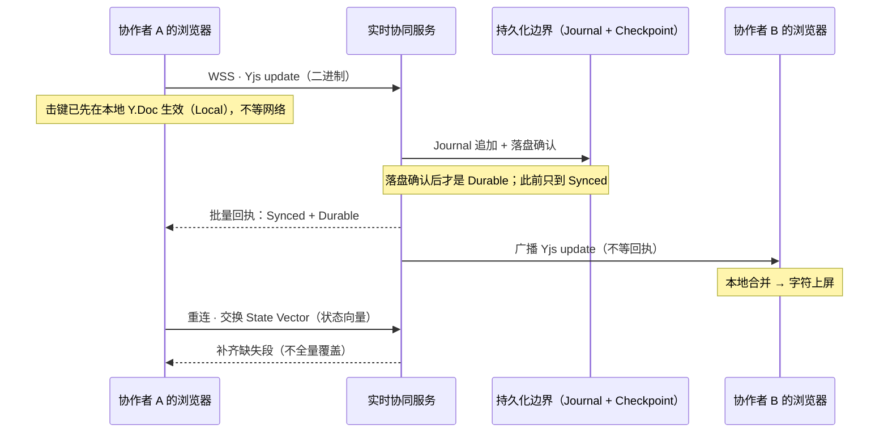
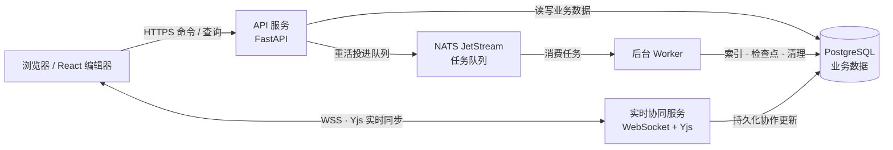

# 墨屿 · Moyu Docs

墨屿是一款本地优先的团队协同文档软件：多个人可以同时编辑同一篇文档，任何一方的修改会实时出现在其他人的屏幕上；断网时本地继续可写，重连后自动补齐。整个系统由三条路支撑：

- **普通读写**：浏览器用 HTTPS 发命令 / 查询到 API 服务，账号、权限、工作区与资源等业务数据写入 PostgreSQL。
- **实时内容**：浏览器用 WebSocket 连到实时协同服务，由 Yjs 同步引擎把修改转发给其他协作者。
- **后台重活**：索引、检查点、清理等不着急的作业放进 NATS 队列，由 Worker 异步执行后写回 PostgreSQL。

前后端接口只在 `/contracts` 定义一份，自动生成 TypeScript 与 Python 强类型，字段写错在编译阶段就会被拦住。Web 编辑器、API、实时协同服务、后台 Worker 与共享契约放在同一个 Monorepo 中；仓库、包名与数据库沿用技术标识 **DOM**（`@dom/web`、`@dom/realtime`、`dom_dev`），与产品名「墨屿」指同一个项目。

想直接跑起来？跳到文末「本地运行」。

## 协同怎么工作

一次编辑要经过哪些环节？下面这条时间线回答三个问题：谁先看到修改、什么时候算「服务器已收到」、什么时候算「已落盘」。先约定几个词：

- **Resource**：实时协作的边界。每篇文档就是一个 Resource，各自独立同步。
- **Y.Doc**：Yjs 的文档对象，本地修改先写进它。Yjs 是 CRDT（无需中心仲裁的冲突解决结构）：并发修改无论以什么顺序合并，结果都相同。
- **Local / Synced / Durable**：同一条修改的三档确认程度——本地已生效、服务器已接收、已写进持久化日志（Journal）。
- **Awareness**：在线成员、光标、选区这类临时状态，只广播、不写进正文。



几个容易误读的点：

- **广播不等回执**。服务端把修改推给其他协作者后不等待应答；回执是批量水位（图中那条「批量回执」），不是每条消息的 ACK。B 漏收了，靠重连对账补齐。
- **「发送成功」不等于「已保存」**。WebSocket 发送成功只说明数据进了网络，服务器可能还没收到，更没落盘。
- **重连靠补差，不做整份覆盖**。离线期间的修改不会丢：重连时两端交换状态向量，只补缺失的那一段。
- **恢复顺序**。先加载最近的 Checkpoint（定期快照），再重放其后的 Journal 记录；Journal 是恢复主链，Checkpoint 只是把恢复起点提前。

每个 Resource 的协作状态互相独立；在线成员、光标与选区走 Awareness，不进正文。

## 架构图

HTTPS 承担普通读写，WebSocket 承担实时内容同步，后台任务经 NATS 交给 Worker。



图外的支撑组件：**Valkey** 提供缓存与会话（已在使用）；**S3 兼容对象存储**承载附件（已有实现）；**OpenSearch** 搜索是技术栈里的设计目标，目前尚未落地——当前检索由 PostgreSQL 承担。

## 数据结构

三层结构各管一件事，把「协作边界」和「目录组织」分开：

- **Workspace**：内容的顶层容器。成员与权限按工作区 / 项目 / 资源三级授予。
- **Project / Folder**：只负责组织资源；移动或重命名不改变资源的身份。
- **Resource**：实时协作的边界。每篇文档是一个 Resource，各自有独立的 Y.Doc 与协作会话，互不阻塞。`resourceId` 稳定不变——改名字、换文件夹既不会让协作者掉线，也不会丢历史。

```text
Workspace
└── Project
    ├── Folder
    │   └── Resource (resourceId)
    └── Resource (resourceId)
        └── Y.Doc
            └── Document Node tree (nodeId)
```

文档正文由 Y.Doc 承载；段落、标题、表格等是带稳定 `nodeId` 的节点（Node），跨文档引用用 `resourceId + nodeId` 定位，不依赖 DOM 路径或字符偏移，所以结构调整不会让引用失效。

PostgreSQL 存账号、权限、工作区、项目、资源等业务信息；文档正文的协作更新通过 Journal 与 Checkpoint 持久化（Journal 记增量、Checkpoint 缩短恢复路径），供断线重连与服务恢复使用。代码、Markdown 等 Resource 可以使用自己的内容模型，不必都变成文档节点树——Resource 是协作边界，节点树只是文档这类内容的模型。

## 使用的技术

选型围绕两条要求：本地优先的实时编辑，以及前后端共用一份契约。

- **Web 编辑器**：React 19、TypeScript、Vite；TanStack Query 管服务端数据，Zustand 管界面状态——把「服务器数据」和「本地界面状态」分开，避免两套状态互相污染。
- **文档编辑与协同**：Tiptap / ProseMirror 负责编辑体验，Yjs 负责 CRDT 合并，WebSocket 负责传输。选 CRDT 是因为它满足「本地先应用、任意顺序合并都收敛」，这是本地优先与离线编辑的前提。
- **服务端**：Python 3.12 + FastAPI，按模块化单体组织（领域模块同进程运行，边界由依赖方向约束）；实时协同服务用 TypeScript / Node.js，与 Yjs 生态同语言。
- **数据与后台**：PostgreSQL 是业务数据的事实来源；Valkey 管缓存与会话；NATS JetStream 分发后台任务；附件放 S3 兼容对象存储。OpenSearch 搜索尚未落地，当前检索由 PostgreSQL 承担。
- **契约与代码生成**：`/contracts` 是机器契约的唯一源头，生成 TypeScript 与 Python 两套强类型；生成物进 CI 漂移检查，手改会被下一次生成覆盖。

本地 Compose 只启动 PostgreSQL、Valkey、NATS 和维护 Worker；Web、API 与实时服务按下面的命令单独启动。

## 本地运行

需要 Node.js 24、pnpm 12、Python 3.12、uv、Docker Compose 和 just。首次安装依赖：

```sh
pnpm install --frozen-lockfile
uv sync --all-packages --locked
```

在仓库根目录创建 `.env`，设置本地数据库和 Valkey 地址：

```dotenv
DATABASE_URL=postgresql+psycopg://torch@localhost:5432/dom_dev
VALKEY_URL=redis://localhost:6379/14
```

先启动 PostgreSQL、Valkey 和 NATS，再初始化数据库：

```sh
docker compose up -d postgres valkey nats
uv run --env-file .env alembic -c migrations/postgres/alembic.ini upgrade head
```

数据库初始化后，再启动维护 Worker：

```sh
docker compose up -d maintenance-worker
```

再分别在三个终端启动 API、实时协同服务和 Web（`just dev-api` 会先检查根目录 `.env` 是否存在）：

```sh
just dev-api
```

```sh
REALTIME_DATABASE_URL=postgresql://torch@localhost:5432/dom_dev pnpm --filter @dom/realtime dev
```

```sh
pnpm --filter @dom/web dev
```

打开 <http://localhost:5173>，注册后即可进入工作区。
