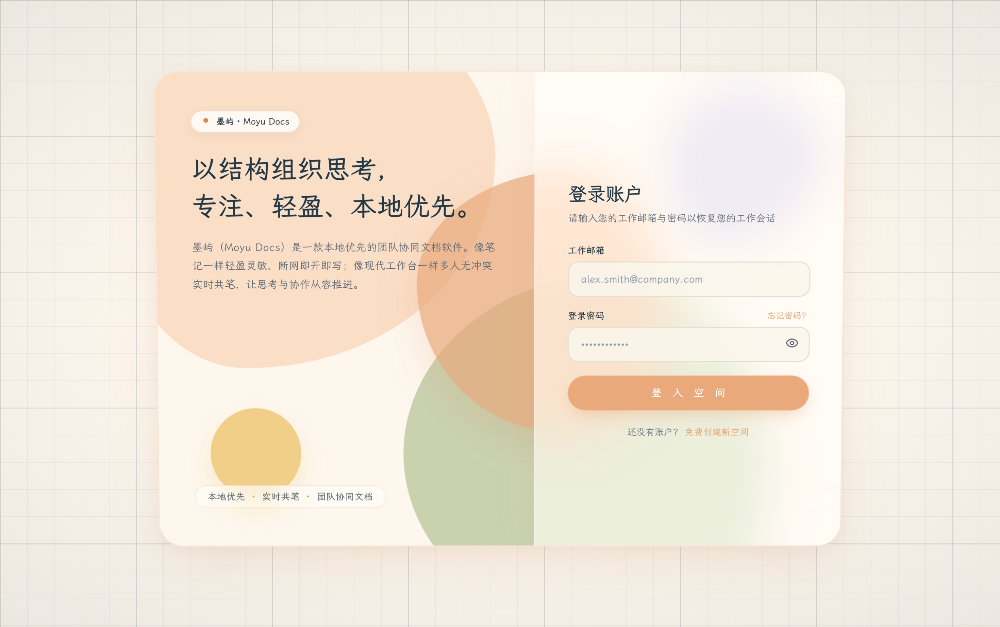
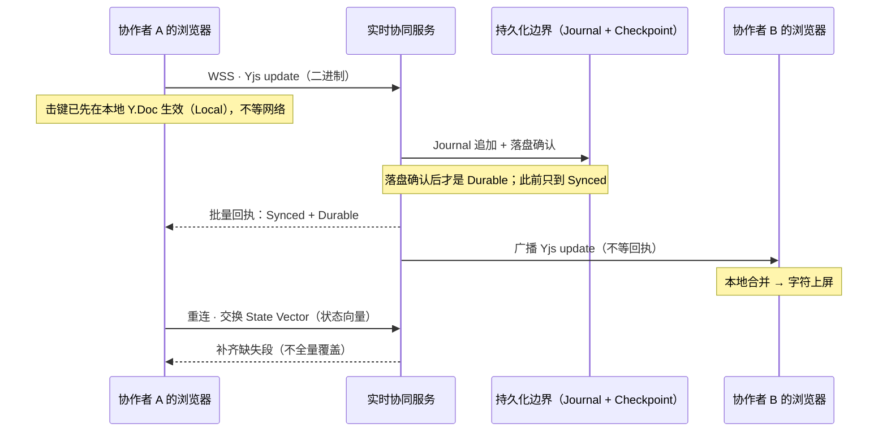
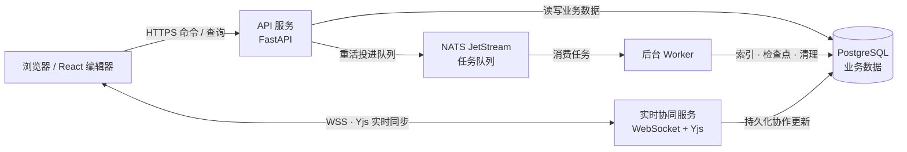

# 墨屿 · Moyu Docs

墨屿是一个多人实时协作的文档与工作区。在这里，好几个人可以同时编辑同一篇文档，任何一个人的修改都会实时出现在其他协作者的屏幕上；就算断网，本地也依然可以继续写，等网络恢复后再自动补齐。整个项目由 Web 编辑器、API 服务、实时协同服务、后台 Worker 和共享契约构成，它们都放在同一个 Monorepo 仓库里。



想先把它跑起来看看，直接跳到文末的「本地运行」。

## 协同怎么工作

我们从一次最普通的编辑说起：你在文档里敲下一个字，接下来会发生四步，每一步都对应一档确认程度，分别叫 Local、Synced 和 Durable。把这四步分清楚，就不会再把"消息发出去了"误当成"修改已经保存了"。

第一步发生在你自己的电脑上。你敲下的字符会先写进本机的 Y.Doc，也就是 Yjs 用来保存文档内容的那个对象，屏幕上的文字会立刻变化。这一步完全不需要经过网络，所以就算断网你也能正常打字。这就是本地优先的含义：编辑永远先于网络发生，你的输入不会因为网络不稳定而卡住。

第二步发生在服务器上。你的修改会被打包成一个二进制的 update 消息，通过 WebSocket 发送给实时协同服务，当服务端成功应用了这个 update，这次修改才算被服务器接收，这一档叫 Synced。在那之前，修改只存在于本地。

第三步是落盘。实时协同服务会把 update 追加进一个叫 Journal 的持久化日志，等落盘确认之后，这次修改才算真正安全，因为就算机器重启，它也不会丢。服务器还会随更新返回一个批量回执，相当于"已经同步到哪一步"的水位线，只有被回执覆盖到的修改才算数。这里顺带区分两个概念：Journal 记录每一次增量，是恢复时的主链；Checkpoint 是定期生成的一份快照，作用只是让恢复的起点更靠前，它并不是另一份真相。

第四步是广播。实时协同服务会把同一份 update 转发给其他协作者，他们各自在本地完成合并，文字就出现在他们的屏幕上了。这一步不需要对方回执，你不必等所有人都确认收到才能继续编辑。万一某个协作者中途掉线漏掉一部分更新，等他重连之后，系统会通过后面讲的重连流程把缺的部分补齐。



看到这儿你可能想问：如果两个人同时修改同一个位置，结果会不会乱？答案是不会。因为同步层用的是 CRDT，也就是 Yjs 里的 YATA 算法，它的特性是并发的修改不会互相覆盖，而是都保留下来，最终顺序由修改的相对位置和客户端编号共同决定，并且所有端看到的顺序一定一致。并发的删除则是幂等的，同一段内容删一次就生效，重复删除不会改变结果。正因如此，这套系统把"必须最终收敛"定为硬性要求。

另一个常见问题是断网之后怎么办。离线期间的编辑是有效状态，不会被服务器上的内容覆盖。重新连接时，双方会交换各自的 State Vector（状态向量）来对账，只补缺失的那一段，不会整份覆盖。恢复的具体顺序是，先加载最近的 Checkpoint 快照，再重放它之后的所有 Journal 记录。

## 数据结构

文档的内容并不是杂乱存放的。整个系统按四个层次组织内容，而且只有最里层才参与实时协作。

最外层是工作区（Workspace），它是所有内容的顶层容器，成员的权限也按工作区、项目、资源这三层来授予。第二层是项目和文件夹（Project 和 Folder），它们只负责把资源归置整齐，移动或者重命名一个资源，并不会改变这个资源的身份。第三层是资源（Resource），它是真正的实时协作边界：每篇文档就是一个资源，每个资源各自拥有独立的 Y.Doc 和协作会话，互不阻塞。资源的身份由 resourceId 标识，这个标识稳定不变，所以改名字、换文件夹，既不会让协作者掉线，也不会丢失历史。

```text
Workspace
└── Project
    ├── Folder
    │   └── Resource (resourceId)
    └── Resource (resourceId)
        └── Y.Doc
            └── Document Node tree (nodeId)
```

再往里是文档本身。文档里的段落、标题、表格等内容是一个个带稳定 nodeId 的节点。如果要跨文档引用某个位置，系统用 resourceId 加 nodeId 来定位，完全不依赖 DOM 路径或字符偏移，所以文档结构怎么调整，引用都不会失效。顺手说明一点：像代码、Markdown 这类资源，可以使用自己的内容模型，不一定都要长成文档节点树。

至于数据存在哪里，分工是这样的：账号、权限、工作区、项目、资源这些业务信息保存在 PostgreSQL 里；文档正文的协作更新则通过 Journal 和 Checkpoint 持久化，供断线重连和服务恢复使用。另外，在线成员、光标、选区这类临时状态走 Awareness 通道，只做广播、不写进正文，因此不会污染文档历史。

## 架构图

把刚才讲的功能落到进程上，就是下面这张图：HTTPS 承担普通读写，WebSocket 承担实时内容同步，后台任务经 NATS 交给 Worker 异步执行。



浏览器里跑的是 React 编辑器，它负责普通读写和实时收发。API 服务用 Python 的 FastAPI 编写，处理账号、权限、工作区、资源这些业务，并读写 PostgreSQL。实时协同服务用 TypeScript 编写，它是 WSS 网关加 Yjs 中继，负责把 update 落盘并发广播，也就是前面说的第二、三、四步。后台 Worker 用 Python 编写，处理索引、检查点、清理这类不着急的活，任务通过 NATS JetStream 排队。

再补两个支撑组件：Valkey 提供缓存与会话，附件存放在 S3 兼容对象存储里，本地开发用的就是 MinIO。搜索方面，OpenSearch 是技术栈里规划的目标，目前还没有落地，现在的检索由 PostgreSQL 承担。

## 使用的技术

- **Web 编辑器**：React 19、TypeScript、Vite、React Router；TanStack Query（服务端数据）、Zustand（界面状态）；ProseMirror / Tiptap（编辑）、Yjs（协同）
- **实时协同服务**：TypeScript、Node.js、WebSocket、Yjs
- **API 服务**：Python 3.12、FastAPI
- **后台 Worker**：Python、NATS JetStream（任务队列）
- **数据与存储**：PostgreSQL（业务数据）、Valkey（缓存 / 会话）、S3 兼容对象存储（附件，本地环境为 MinIO）
- **契约**：`/contracts` 单一来源，生成 TypeScript 与 Python 强类型

## 本地运行

运行它需要 Node.js 24、pnpm 12、Python 3.12、uv、just，以及 openssl。

如果是在一台新机器上，第一次之前先装好依赖：

```sh
pnpm install --frozen-lockfile
uv sync --all-packages --locked
```

改代码的时候，也可以改用本机进程来跑。这条路径需要你自己准备能连到的 PostgreSQL、Valkey 和 NATS，把地址写进根目录的 `.env` 文件，`just dev-api` 会先检查这个文件是否存在。三个服务分别这样起：

```sh
just dev-api                      # API：http://127.0.0.1:8000
pnpm --filter @dom/realtime dev   # 实时协同服务：ws://localhost:8765
pnpm --filter @dom/web dev        # Web：http://localhost:5173
```

Web 开发服务器会把 /v1 接口和实时连接代理到本地的 API 与实时服务，所以浏览器只需要访问 http://localhost:5173 就够了。
