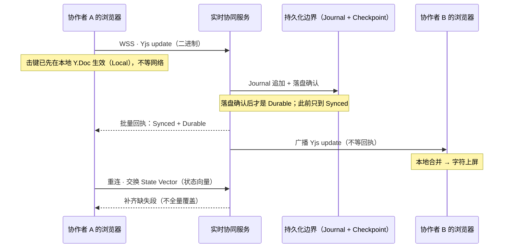
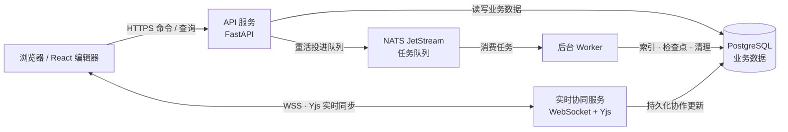

# 墨屿 · Moyu Docs

墨屿是一个多人实时协作的文档与工作区。在这里，好几个人可以同时编辑同一篇文档，任何一个人的修改都会实时出现在其他协作者的屏幕上；就算断网，本地也依然可以继续写，等网络恢复后再自动补齐。整个项目由 Web 编辑器、API 服务、实时协同服务、后台 Worker 和共享契约构成，它们都放在同一个 Monorepo 仓库里。


想先把它跑起来看看，直接跳到文末的「本地运行」。

## 协同怎么工作

一次编辑在系统中的传播分四步进行，每一步对应一档确认程度：Local、Synced 与 Durable。理清这三档的区别，就不会再把"消息已发出"误当作"修改已保存"。

**第一步，本地生效（Local）。** 击键先写入本机的 CRDT 文档对象 Y.Doc，编辑器立即反映修改，整个过程不经过网络，因此断网期间也能正常编辑。这是本地优先的核心含义：编辑先于网络发生，不受网络状态影响。

**第二步，服务端接收（Synced）。** 修改被封装为二进制 update 消息，经 WebSocket 发送至实时协同服务；服务端成功应用该 update 后，本次修改才达到 Synced 档。在此之前，修改仅存在于本地。

**第三步，落盘确认（Durable）。** 实时协同服务将 update 追加进 Journal 持久化日志，落盘确认后修改达到 Durable 档，此时即使服务重启也不会丢失。服务端同时返回批量回执，即同步水位线，只有回执覆盖到的修改才算完成同步。这里需要区分两个概念：Journal 记录每次增量，是恢复过程的主链；Checkpoint 是定期生成的快照，作用仅是前移恢复起点，并非另一份独立真相。

**第四步，广播。** 实时协同服务将同一份 update 转发给其他协作者，由各端在本地合并后展示。此步骤不要求接收端回执，编辑过程无需等待其他客户端确认；若某协作者中途断线遗漏部分更新，重连后由下文所述的重连流程补齐。



**并发修改如何保证不乱？** 同步层采用 CRDT（Yjs 的 YATA 算法）：并发修改互不覆盖、全部保留，最终顺序由修改的相对位置与客户端编号共同决定，且各端一致；并发删除是幂等的，重复删除不改变结果。因此协议将"必须最终收敛"作为硬性要求，一致性由数据结构本身保证。

**断网与恢复。** 离线期间的编辑保持有效，不会被服务器内容覆盖。重连时双方交换 State Vector（状态向量）对账，仅补齐缺失部分，不做整份覆盖。恢复顺序为：先加载最近的 Checkpoint 快照，再重放其后的全部 Journal 记录。

## 数据结构

内容按四个层次组织，只有最里层参与实时协作。

最外层是工作区（Workspace），作为内容的顶层容器，成员权限按工作区、项目、资源三级授予。第二层是项目与文件夹（Project、Folder），负责组织资源，移动或重命名不改变资源身份。第三层是资源（Resource），即实时协作的边界：每篇文档对应一个资源，各资源拥有独立的 Y.Doc 与协作会话，互不阻塞。资源身份由稳定不变的 resourceId 标识，因此改名或调整目录不会导致协作者掉线或历史丢失。

```text
Workspace
└── Project
    ├── Folder
    │   └── Resource (resourceId)
    └── Resource (resourceId)
        └── Y.Doc
            └── Document Node tree (nodeId)
```

最内层是文档内容。段落、标题、表格等元素均为带稳定 nodeId 的节点；跨文档引用通过 resourceId 与 nodeId 定位，不依赖 DOM 路径或字符偏移，因此结构变动不会使引用失效。此外，代码、Markdown 等资源可使用各自的内容模型，无需统一呈现为文档节点树。

数据持久化分工如下：账号、权限、工作区、项目、资源等业务信息存于 PostgreSQL；文档正文的协作更新经 Journal 与 Checkpoint 持久化，供断线重连与服务恢复使用。在线成员、光标、选区等临时状态走 Awareness 通道，仅广播、不写入正文，不污染文档历史。

## 架构图

上述功能在进程层面的分布如下：HTTPS 承担普通读写，WebSocket 承担实时内容同步，后台任务经 NATS 交由 Worker 异步执行。



浏览器端为 React 编辑器，负责普通读写与实时收发。API 服务基于 Python / FastAPI，处理账号、权限、工作区、资源等业务并读写 PostgreSQL。实时协同服务基于 TypeScript，承担 WSS 网关与 Yjs 中继，负责 update 的落盘与广播，即前文所述的第二至四步。后台 Worker 基于 Python，经 NATS JetStream 消费索引、检查点、清理等异步任务。

支撑组件还包括：Valkey 提供缓存与会话；附件存放于 S3 兼容对象存储，本地开发环境使用 MinIO；OpenSearch 为规划中的搜索方案，尚未落地，当前检索由 PostgreSQL 承担。

## 使用的技术

- **Web 编辑器**：React 19、TypeScript、Vite、React Router；TanStack Query（服务端数据）、Zustand（界面状态）；ProseMirror / Tiptap（编辑）、Yjs（协同）
- **实时协同服务**：TypeScript、Node.js、WebSocket、Yjs
- **API 服务**：Python 3.12、FastAPI
- **后台 Worker**：Python、NATS JetStream（任务队列）
- **数据与存储**：PostgreSQL（业务数据）、Valkey（缓存 / 会话）、S3 兼容对象存储（附件，本地环境为 MinIO）
- **契约**：`/contracts` 单一来源，生成 TypeScript 与 Python 强类型

## 本地运行

运行它需要 Node.js 24、pnpm 12、Python 3.12、uv、just，以及 openssl。

如果是在一台新机器上，第一次之前先装好依赖：

```sh
pnpm install --frozen-lockfile
uv sync --all-packages --locked
```

改代码的时候，也可以改用本机进程来跑。这条路径需要你自己准备能连到的 PostgreSQL、Valkey 和 NATS，把地址写进根目录的 `.env` 文件，`just dev-api` 会先检查这个文件是否存在。三个服务分别这样起：

```sh
just dev-api                      # API：http://127.0.0.1:8000
pnpm --filter @dom/realtime dev   # 实时协同服务：ws://localhost:8765
pnpm --filter @dom/web dev        # Web：http://localhost:5173
```

Web 开发服务器会把 /v1 接口和实时连接代理到本地的 API 与实时服务，所以浏览器只需要访问 http://localhost:5173 就够了。